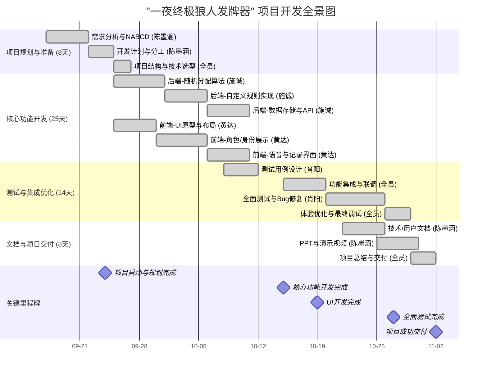

# 一夜终极狼人发牌器 - 项目最终总结甘特图

**项目周期**: 2025年9月17日 - 2025年11月2日 (共47天)
**项目状态**:  已成功完成并交付

**团队成员**:
- **陈墨涵 (组长)**: 需求分析、项目管理、文档与展示
- **黄达 (UI开发)**: 图形界面设计与实现
- **施诚 (核心逻辑)**: 后端算法、数据与API开发
- **肖阳 (测试优化)**: 功能测试与用户体验优化

---

##  项目开发全景甘特图 (Mermaid 格式)

---

##  详细时间线与成果

### **第一阶段: 项目规划与准备 (9/17 - 9/24)** 
- **成果**: 明确了项目目标、功能优先级,完成了NABCD分析,并制定了详细的开发计划与技术方案。
- **负责人**: 陈墨涵主导,全员参与。

### **第二阶段: 核心功能开发 (9/25 - 10/19)** 
- **施诚 (后端)**:
  - **随机分配算法**: 实现了公平、高效的角色随机分配逻辑。
  - **自定义规则**: 支持玩家根据人数和偏好调整角色池。
  - **数据存储与API**: 开发了用于保存历史对局的接口,为前端提供数据支持。
- **黄达 (前端)**:
  - **图形化界面**: 使用 PySide6/Tkinter 搭建了美观、友好的用户界面。
  - **身份展示**: 实现了"仅查看一次"的隐私保护功能。
  - **语音与记录**: 集成了语音提示功能,并开发了历史对局的展示界面。

### **第三阶段: 测试与集成优化 (10/15 - 10/28)** 
- **成果**: 完成了前后端功能的顺利集成,修复了测试中发现的Bug,并对软件的稳定性和用户体验进行了优化。
- **负责人**: 肖阳主导测试,全员参与集成与调试。

### **第四阶段: 文档与项目交付 (10/26 - 11/02)** 
- **成果**: 完成了所有必要文档的撰写(技术文档、用户手册),制作了高质量的演示PPT和视频,并于11月2日成功交付项目。
- **负责人**: 陈墨涵主导,全员配合。

---

## 最终总结

在为期47天的开发周期中,团队成员各司其职、紧密协作,按时并高质量地完成了"一夜终极狼人发牌器"的开发工作。项目从需求分析、开发、测试到最终交付,各环节均按计划顺利推进,最终实现了全部核心功能,达到了预期目标。这是一个成功且完整的项目实践。
